# Animus: Distributed Cyber-Physical IoT Telemetry & Autonomous Agent Architecture

[](https://www.python.org/)
[](https://fastapi.tiangolo.com/)
[](https://kotlinlang.org/)
[](https://developer.android.com/jetpack/compose)
[](server/music_daemon/tests)
[]()
[]()
[]()

> **Animus** is an enterprise-grade, event-driven cyber-physical automation and telemetry architecture. It unifies real-time multi-device IoT streaming (Tuya Protocol 3.3, Wi-Fi ADB, WinRT Bluetooth WASAPI audio graphs, OpenCV computer vision) with an autonomous, dual-engine cognitive agent that decomposes compound natural language queries into deterministic, verified hardware state transitions.
>
> 📊 **Recruiter & Hiring Manager Quick Guide**: Check out the [Data Analyst & Analytics Engineering Portfolio Guide](docs/DATA_ANALYST_PORTFOLIO_GUIDE.md) for technical interview cheatsheets, ready-to-use resume bullets, and Blinkit SQL project mapping.

---

## 🏗️ System Architecture

```mermaid
flowchart TD
    subgraph Clients["User Touchpoints & Interaction Layers"]
        AndroidApp["📱 Android App\n(Kotlin + Jetpack Compose)"]
        WebDash["💻 Glassmorphic Web UI\n(WebSocket + REST 8095)"]
        Console["⌨️ Interactive CLI Console\n(animus_console.py)"]
    end

    subgraph Daemon["Animus Host Daemon (Python 3.11 / FastAPI / AsyncIO)"]
        Router["⚡ REST & WebSocket Router\n(Port 8095)"]
        EventBus["📢 In-Memory Pub/Sub EventBus\n(TTL + Sliding Window Buffer)"]
        Perception["👁️ Perception Collector\n(Room Audio, Presence, Telemetry)"]
        
        subgraph Cognitive["Cognitive Decision Engine"]
            Decomp["🔍 Compound Intent Decomposer\n(Multi-clause Splitter & FastPaths)"]
            LocalLLM["🧠 Local Ollama Supervisor\n(Qwen 4B / Structured JSON Tool Calls)"]
            Memory["💾 State & Long-Term Memory\n(SQLite + Pydantic Serialization)"]
        end
        
        subgraph Hardware["Hardware Abstraction & Physical Device Drivers"]
            AC["❄️ AcController\n(Tuya Local 3.3 UDP/TCP 6668)"]
            FireTV["📺 FireTvController\n(Wi-Fi ADB TCP 5555)"]
            Projector["📽️ ProjectorController\n(Wi-Fi ADB + Tuya IR Blaster)"]
            Soundbar["🔊 DevicePortal / BluetoothHelper\n(WinRT + WASAPI Audio Router)"]
            Printer["🖨️ PrinterController\n(Format-Aware A4 Scaling + Spooler)"]
            Vision["📷 VisionObserver\n(OpenCV Desk Presence Telemetry)"]
        end
        
        subgraph SelfHealing["Dynamic Resilience & Network Sync"]
            ARP["🛡️ Dynamic ARP/MAC Auto-Discovery\n(Subnet Ping Sweep & DHCP Sync)"]
            Watchdog["⏱️ Hardware Watchdog & Reconnect Loop"]
        end
    end

    AndroidApp <-->|HTTP / WebSocket| Router
    WebDash <-->|WebSocket Real-time Feed| Router
    Console <-->|REST API| Router

    Router --> Decomp
    Decomp -->|Deterministic Match| Hardware
    Decomp -->|Complex Intent| LocalLLM
    LocalLLM -->|Validated Tool Calls| Hardware
    
    Vision --> Perception
    Hardware --> Perception
    Perception --> EventBus
    EventBus --> Memory
    ARP -.-> Hardware
```



---

## 🌟 Key Technical Highlights

### 1. 📡 Real-Time IoT Telemetry & Sensory Pipelines
* **Zero-Cloud Local Ingestion**: Direct local LAN communication with physical climate units using **Tuya Protocol 3.3 (UDP/TCP port 6668)**, bypassing external cloud throttles and preserving privacy.
* **Computer Vision Desk Presence**: Background OpenCV camera stream computing desk occupancy telemetry to drive autonomous, context-aware room automations.
* **Audio Routing & WASAPI Interop**: Programmatic WinRT and Windows Device Portal Bluetooth integration dynamically acquiring the LG SNC4R soundbar endpoint for low-latency Edge Neural TTS and audio playback.

### 2. 🧠 Dual-Engine Agent Cognition & Multi-Command Parsing
* **Compound Intent Decomposition**: Custom clause splitter (`_decompose_compound_utterance`) analyzing conjunctions (`and`, `also`, `then`) and punctuation to orchestrate multi-device sequences (e.g., *"Turn off the AC, turn on the projector, and play focus beats"*).
* **Deterministic FastPaths with LLM Fallback**: Executes immediate physical actions via zero-latency regex matching; transparently falls back to local GPU-accelerated **Ollama (Qwen 4B)** for nuanced multi-turn conversational reasoning.
* **Structured Tool Invocation**: Enforces rigid JSON schema contracts for all device commands, eliminating hallucinated executions.

### 3. 🛡️ Dynamic Self-Healing & Physical Safety Invariants
* **Hardware MAC-Based Auto-Discovery**: Automatically inspects the Windows ARP cache and executes non-disruptive subnet sweeps to re-bind shifting DHCP lease IPs without manual configuration across router reboots (`scripts/discover_and_connect_adb.py`).
* **Strict Physical Invariants**: Built-in state safeguards prevent race conditions:
  * Never cuts audio during active user media.
  * Projector hardware cutoff prevents lamp burnout.
  * AC commands enforce valid operating modes and temperature clamps (16°C–30°C).

### 4. 🖨️ Intelligent Document-Aware A4 & Photo Spooling Engine
* **A4 Hardware-Bleed Maximization**: Eliminates double-margin shrinking bugs by binding directly to driver hardware boundaries (`hwX=12, hwY=12` ~ 3mm), maximizing A4 coverage to **97.1%** (+28.1% scale expansion for executive resumes and portfolios).
* **High-DPI PDF Vector Rasterization**: Native PyMuPDF multi-page rendering at **300 DPI** (`2481 x 3508` px) streaming directly to the Windows GDI spooler with zero external viewer dependencies.
* **Photo-Paper Master Rendering**: Automatically detects image aspect ratio (auto-orients to Landscape A4 for wide photos), activating **1200 DPI droplet control**, full color mode, and `HighQualityBicubic` interpolation for photo-paper prints.
* **Intelligent Code & SQL Layout**: Pre-flight line length analyzer that dynamically auto-switches to **Landscape A4** when line length > 105 characters to prevent awkward wrapping on wide SQL joins and data tables; dynamically scales font (8.5pt / 9.5pt Consolas) and renders line numbers with an executive header.

### 5. 📱 Multi-Client Control Planes
* **Android Client**: Native **Kotlin & Jetpack Compose** app featuring real-time room state cards, file attachment printing, and a dark glassmorphic design.
* **Web Dashboard**: High-density glassmorphic dashboard built with vanilla CSS & WebSockets for sub-10ms UI telemetry updates.
* **Interactive CLI**: Dedicated terminal console (`animus_console.py`) for direct operator query dispatch, hardware audits, and memory inspection.

---

## 🛠️ Technology Stack

| Layer | Technologies |
|---|---|
| **Backend & Ingestion** | Python 3.11+, FastAPI, Uvicorn, AsyncIO, Pydantic v2 |
| **Edge AI & Speech** | Ollama (`qwen3:4b-instruct`), Edge Neural TTS (`en-GB-SoniaNeural`), OpenCV |
| **Mobile Client** | Kotlin 1.9, Jetpack Compose, Material 3, Coroutines, Retrofit/OkHttp |
| **Frontend Web** | Vanilla HTML5/CSS3 (Glassmorphism), WebSockets, REST |
| **Protocols & Hardware** | Tuya Local 3.3, Android Debug Bridge (ADB), WinRT, Windows Device Portal, WASAPI |
| **Testing & Quality** | Pytest, Pytest-AsyncIO, Pytest-Mock (**1,300+ Automated Unit & Integration Tests**) |
| **Data Persistence** | SQLite (`animus_memory.db`), In-Memory TTL Event Bus, JSON Schema |

---

## 🧪 Comprehensive Automated Test Harness

The system incorporates rigorous testing standards to guarantee zero regressions across physical hardware drivers and state machines:

```bash
# Run the complete test suite
pytest server/music_daemon/tests
```

```text
============================= test session starts =============================
platform win32 -- Python 3.13.7, pytest-9.1.1, pluggy-1.6.0
rootdir: D:\AnimusSmartRoom\server\music_daemon
collected 1365 items

server/music_daemon/tests/test_multi_command_intent_decomposition.py ....... [ 100%]
server/music_daemon/tests/test_custom_file_printing.py ..................... [ 100%]
server/music_daemon/tests/test_work_presence_integration.py ............... [ 100%]
server/music_daemon/tests/test_ac_controller.py ........................... [ 100%]
server/music_daemon/tests/test_projector_controller.py .................... [ 100%]

====================== 1365 passed, 2 warnings in 42.18s ======================
```

---

## 📂 Repository Layout

```
AnimusSmartRoom/
├── app/                                # Android Application Module (Kotlin & Jetpack Compose)
│   ├── src/main/java/com/animus/smartroom/
│   │   ├── brain/client/               # Remote Clients (Printer, Brain, Audio)
│   │   ├── context/client/             # Room State Sync via REST/WebSocket
│   │   ├── ui/glass/                   # Immersive Glassmorphic UI Components
│   │   └── MainActivity.kt             # Primary Android Entry Point
│   └── build.gradle.kts                # Gradle Android Build Configuration
├── scripts/
│   └── discover_and_connect_adb.py     # MAC-based Dynamic Subnet Discovery & Auto-Sync
├── server/
│   └── music_daemon/                   # Primary Host Daemon & System Core
│       ├── ac_controller.py            # Tuya Local Protocol 3.3 Climate Controller
│       ├── ac_command_router.py        # AC FastPath Intent Router
│       ├── animus_console.py           # Interactive Operator Terminal Console
│       ├── automation_registry.py      # Scheduled & Triggered Room Automations
│       ├── bluetooth_helper.py         # WinRT / WASAPI Audio Endpoint Manager
│       ├── device_portal.py            # Windows Device Portal Bluetooth Controller
│       ├── device_scanner.py           # Authoritative Non-Disruptive Hardware Auditor
│       ├── event_bus.py                # In-Memory Event Streaming Bus
│       ├── fire_tv_controller.py       # Wi-Fi ADB Fire OS Controller
│       ├── main.py                     # FastAPI Application Entrypoint & REST Routes
│       ├── ollama_manager.py           # Local LLM Lifecycle & Keep-Alive Supervisor
│       ├── orchestrator.py             # Cyber-Physical Room State Orchestrator
│       ├── printer_controller.py       # Format-Aware A4 Scaling & Spooler Manager
│       ├── projector_controller.py     # Smart Projector ADB & IR Transport
│       ├── tts_service.py              # Edge Neural Speech Synthesis Engine
│       ├── vision_observer.py          # OpenCV Desk Occupancy Observer
│       ├── agent/                      # Cognitive Agent Engine
│       │   ├── agent_decision_engine.py# Multi-Command Intent Decomposition & Dispatch
│       │   ├── prompt_builder.py       # Dynamic Context & Schema Assembly
│       │   └── long_term_memory.py     # SQLite State & Fact Persistence
│       ├── tests/                      # Automated Unit & Integration Test Suites (1300+ items)
│       └── web/                        # Real-Time Glassmorphic Web Dashboard
├── start_animus.ps1                    # One-Click System Boot & Discovery Script
├── start_animus.bat                    # Windows Batch Launcher
├── .gitignore                          # Strict Sensitive Data & Artifact Filter
└── README.md                           # System Technical Architecture Documentation
```

---

## 🚀 Quick Start & Installation

### 1. Prerequisites
* **Operating System**: Windows 10/11 (with PowerShell 5.1+)
* **Python**: 3.11 or higher
* **Android**: Android Studio Hedgehog+ and JDK 17 (for mobile APK build)
* **Local LLM** *(Optional)*: [Ollama](https://ollama.ai/) with `qwen2.5:3b` or `qwen3:4b-instruct`

### 2. Environment Setup
```powershell
# Clone the repository
git clone https://github.com/Animus004/Animus_smart_home.git
cd Animus_smart_home

# Install Python backend dependencies
cd server/music_daemon
pip install -r requirements.txt
```

### 3. Launching the System
Run the one-click initialization script in PowerShell:
```powershell
.\start_animus.ps1
```
*Step 1:* Auto-discovers hardware MACs on the local subnet and updates dynamic IPs.  
*Step 2:* Launches the FastAPI server daemon on `http://127.0.0.1:8095`.  
*Step 3:* Starts the interactive Animus console for direct command execution.

### 4. Accessing the Interfaces
* **Web Dashboard**: Open `http://localhost:8095` in any desktop browser.
* **Mobile APK Direct Download**: Open `http://<PC_LOCAL_IP>:8095/app-debug.apk` on your mobile device to download the pre-compiled Android package.

---

## 💼 Industry & Analytical Competencies Demonstrated

This project showcases core engineering, analytical, and systems architecture skills:

* **Event-Driven Data Ingestion**: Designing non-blocking streaming ingestion architectures handling asynchronous hardware telemetry and state events.
* **State Modeling & Schema Validation**: Rigorous schema typing using Pydantic and SQLite to maintain data integrity across distributed nodes.
* **Edge Intelligence & Algorithmic Parsing**: Developing deterministic intent decomposition heuristics paired with GPU-accelerated local LLMs for robust natural language understanding.
* **Resilience Engineering**: Implementing self-healing network protocols (ARP parsing, automated fallback, state recovery) and zero-disruption hardware safety invariants.
* **Full-Stack Systems Integration**: End-to-end telemetry flow spanning embedded device protocols, REST/WebSockets, Kotlin mobile clients, and web dashboards.
