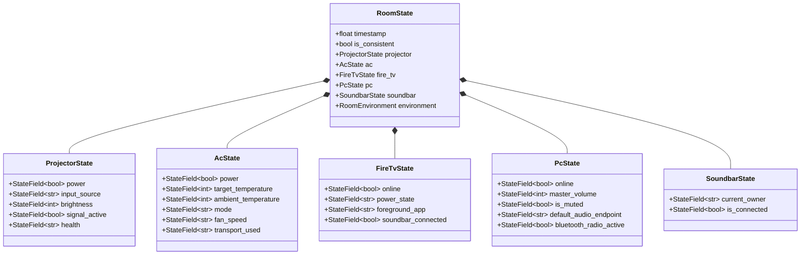
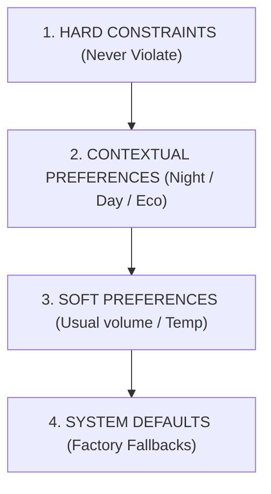
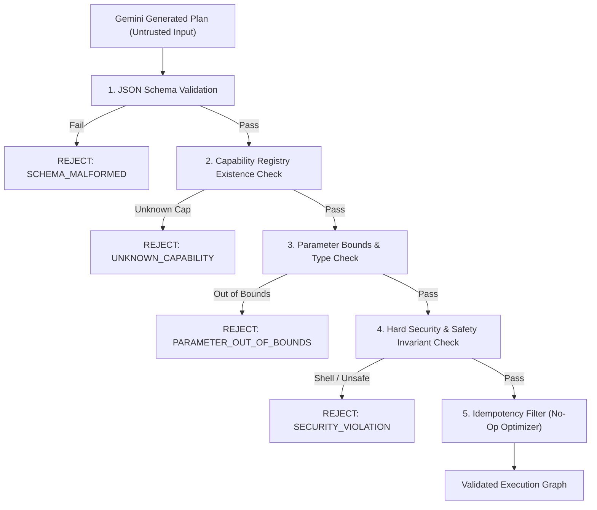
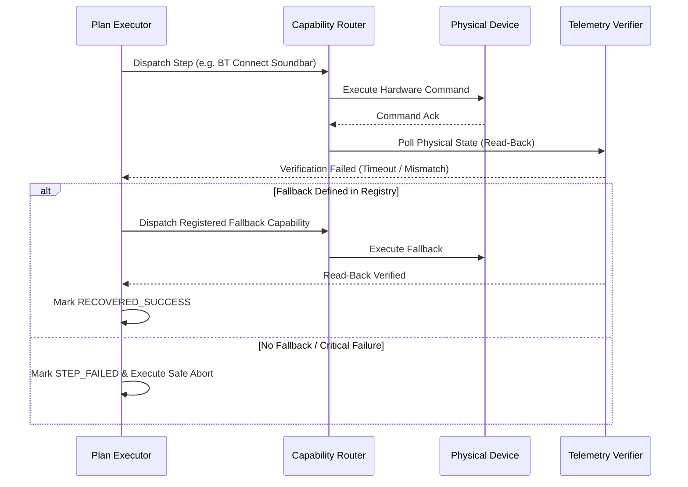
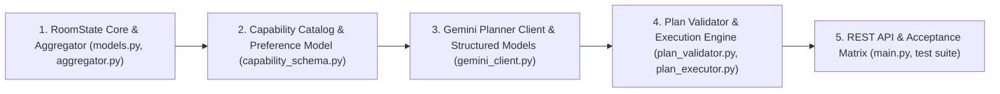

# Animus Smart Room — Phase E.6
# Authoritative Room State & Gemini Structured Planner Architecture Contract

**Document Version**: 1.0.0  
**Date of Architecture Contract**: 2026-08-24  
**Author**: Antigravity Cognitive Agent & Animus Engineering Core  
**Target Systems**: Zebronics PixaPlay 25 Projector, Tuya Split AC, Amazon Fire TV, Animus PC, LG SNC4R Soundbar, Gemini Structured Planner Engine  

---

## 1. Core Architectural Principle & System Philosophy

Animus Smart Room operates on a strict separation of concerns across five cognitive and physical tiers:

```
               +-------------------------------------------------------+
               |                  1. USER INTENT                       |
               |       Natural Language Goal / Utterance / UI         |
               +-------------------------------------------------------+
                                           |
                                           v
               +-------------------------------------------------------+
               |             2. REASONING & PLANNING LAYER             |
               |        Gemini Structured Planner (JSON Schema)        |
               |  Inputs: Authoritative RoomState + Context + Prefs    |
               |  Output: Declarative Capability Step Graph            |
               +-------------------------------------------------------+
                                           |
                                           v
               +-------------------------------------------------------+
               |               3. PLAN VALIDATION GUARD                |
               |    Deterministic Schema & Capability Invariant Gate   |
               |  (Rejects hallucinated devices, bounds, unsafe ops)   |
               +-------------------------------------------------------+
                                           |
                                           v
               +-------------------------------------------------------+
               |               4. EXECUTION ORCHESTRATOR               |
               |       Existing Device Capability Routers & APIs       |
               |     (Projector, AC, Fire TV, PC, Soundbar Routers)    |
               +-------------------------------------------------------+
                                           |
                                           v
               +-------------------------------------------------------+
               |           5. PHYSICAL TELEMETRY & VERIFICATION        |
               |         Hardware Read-Back Polling & State Sink       |
               |       (Updates Authoritative RoomState in Reality)    |
               +-------------------------------------------------------+
```

### The Invariant Axiom:
$$\text{Truth} = \text{Physical Observation} \neq \text{Planner Expectation}$$

1. **The Brain Understands**: Gemini interprets user intent, environmental context, and user preferences within the strict bounds of authoritative state.
2. **The Planner Suggests**: Gemini produces a declarative plan composed strictly of known, registered capability names with validated parameters.
3. **The Guard Validates**: Untrusted planner output is verified against deterministic capability boundaries and safety allowlists before any hardware dispatch.
4. **The Capability Layer Executes**: Existing device controllers execute verified commands.
5. **Physical Devices Verify**: True state is established exclusively via hardware telemetry read-back (e.g. Tuya DP status, CoreAudio scalar volume, ADB dumpsys, HDMI signal detection).
6. **The UI & Brain Report Reality**: No device state is updated based on optimism or assumption.

---

## 2. Existing Codebase Audit & Foundation Analysis

### 2.1 Discovered Physical Devices & Authoritative Controllers

| Physical Device | Model / Identifier | Transport / Endpoint | Authoritative Controller | Verified Physical Capabilities |
|---|---|---|---|---|
| **Projector** | Zebronics PixaPlay 25 (`NL5H00X`, Android 12) | ADB over Wi-Fi (`192.168.1.11:5555`) | `server/music_daemon/projector_controller.py` | `PROJECTOR_POWER_WAKE`, `PROJECTOR_POWER_SLEEP`, `PROJECTOR_POWER_OFF_OEM`, `PROJECTOR_SWITCH_HDMI1`, `PROJECTOR_SWITCH_ANDROID_HOME`, `PROJECTOR_SET_BRIGHTNESS (1-100)`, `PROJECTOR_SET_CONTRAST (1-100)`, `PROJECTOR_NAV_*`, `PROJECTOR_MEDIA_*`. Cold power-on via ADB is strictly `NOT_AVAILABLE`. |
| **Air Conditioner** | Tuya Cooling-Only Inverter Split AC | Local Tuya 3.3 (`192.168.1.4`) + Tuya Cloud OpenAPI Fallback | `server/music_daemon/ac_controller.py` | `AC_POWER_ON`, `AC_POWER_OFF`, `AC_SET_TEMPERATURE (16-30°C)`, `AC_SET_MODE (COOL, AUTO, DRY, FAN)`, `AC_SET_FAN (LOW, MEDIUM, HIGH, AUTO)`, `AC_GET_STATUS`. `HEAT` and Wi-Fi `SWING` are physically unsupported and rejected. |
| **Fire TV** | Amazon Fire TV Stick Lite / 3rd Gen (Fire OS 7.7.1.6) | ADB over Wi-Fi (`192.168.1.5:5555`) | `server/music_daemon/fire_tv_controller.py`, `fire_tv_capabilities.py` | `CONNECTIVITY_CHECK`, `POWER_WAKE`, `POWER_SLEEP`, `NAV_*`, `APP_LAUNCH_*`, `MEDIA_DIRECT_YOUTUBE`, `MEDIA_DIRECT_PROVIDER`, `BT_CONNECT_SOUNDBAR_DIRECT`, `BT_DISCONNECT_SOUNDBAR_DIRECT`. |
| **PC Host** | Animus PC (Windows 11 Pro 64-bit `10.0.26200`) | Direct In-Process CoreAudio COM + 64-bit BluetoothApis (`192.168.1.9`) | `server/music_daemon/pc_controller.py` | `PC_GET_VOLUME`, `PC_SET_VOLUME (0-100)`, `PC_MUTE`, `PC_UNMUTE`, `PC_GET_AUDIO_OUTPUT`, `PC_GET_BLUETOOTH_DEVICES`, `PC_MEDIA_PLAY_PAUSE`, `PC_MEDIA_NEXT`, `PC_MEDIA_PREVIOUS`, `PC_MEDIA_STOP`, `PC_LOCK`, `PC_SLEEP`, `PC_LAUNCH_ALLOWLISTED_APP`. |
| **Soundbar** | LG SNC4R Multi-Channel Soundbar (`54:15:89:DC:A5:79`) | Bluetooth A2DP Sink (Dual-Host Routed) | Direct Bluetooth pairing on PC / Fire TV | Audio sink bonded to Fire TV and PC. Ownership routing coordinated dynamically. |

### 2.2 Discovered Registries & Routers
- **`FireTVCapabilityRegistry`** (`fire_tv_capabilities.py`): Formal 35-capability registry with preconditions, error codes, and execution results.
- **`AcCommandRouter`** (`ac_command_router.py`): Sub-millisecond natural-language parsing for HVAC capabilities with boundary guards.
- **`ProjectorCommandRouter`** (`projector_command_router.py`): 46-command tested natural-language projector router.
- **`PcCommandRouter`** (`pc_command_router.py`): 18-command tested natural-language PC audio, media, and security router.
- **`MediaProviderRegistry`** (`media_provider_registry.py`): Authoritative direct deep-link catalog for YouTube, Netflix, Hotstar, Prime Video, JioCinema, SonyLIV, Zee5.
- **`SmartRoomOrchestrator`** (`orchestrator.py`): High-level audio ownership, queue management, and cinema lifecycle coordinator.

---

## 3. Authoritative Canonical RoomState Schema

The `RoomState` represents the snapshot of physical reality across all room devices. It is compiled strictly from live hardware observations.



### 3.1 JSON Schema Definition for `RoomState`

```json
{
  "$schema": "https://json-schema.org/draft/2020-12/schema",
  "title": "AuthoritativeRoomState",
  "type": "object",
  "required": [
    "timestamp",
    "projector",
    "ac",
    "fire_tv",
    "pc",
    "soundbar",
    "environment"
  ],
  "properties": {
    "timestamp": { "type": "number", "description": "Epoch timestamp of state assembly" },
    "is_consistent": { "type": "boolean", "description": "True if all devices responded without timeout" },
    "projector": {
      "type": "object",
      "required": ["power", "input_source", "brightness", "signal_active"],
      "properties": {
        "power": { "$ref": "#/$defs/StateField_Boolean" },
        "input_source": { "$ref": "#/$defs/StateField_String" },
        "brightness": { "$ref": "#/$defs/StateField_Integer" },
        "signal_active": { "$ref": "#/$defs/StateField_Boolean" },
        "health": { "$ref": "#/$defs/StateField_String" }
      }
    },
    "ac": {
      "type": "object",
      "required": ["power", "target_temperature", "ambient_temperature", "mode", "fan_speed"],
      "properties": {
        "power": { "$ref": "#/$defs/StateField_Boolean" },
        "target_temperature": { "$ref": "#/$defs/StateField_Integer" },
        "ambient_temperature": { "$ref": "#/$defs/StateField_IntegerNullable" },
        "mode": { "$ref": "#/$defs/StateField_String" },
        "fan_speed": { "$ref": "#/$defs/StateField_String" },
        "transport_used": { "$ref": "#/$defs/StateField_String" }
      }
    },
    "fire_tv": {
      "type": "object",
      "required": ["online", "power_state", "foreground_app", "soundbar_connected"],
      "properties": {
        "online": { "$ref": "#/$defs/StateField_Boolean" },
        "power_state": { "$ref": "#/$defs/StateField_String" },
        "foreground_app": { "$ref": "#/$defs/StateField_String" },
        "soundbar_connected": { "$ref": "#/$defs/StateField_Boolean" }
      }
    },
    "pc": {
      "type": "object",
      "required": ["online", "master_volume", "is_muted", "default_audio_endpoint", "bluetooth_radio_active"],
      "properties": {
        "online": { "$ref": "#/$defs/StateField_Boolean" },
        "master_volume": { "$ref": "#/$defs/StateField_Integer" },
        "is_muted": { "$ref": "#/$defs/StateField_Boolean" },
        "default_audio_endpoint": { "$ref": "#/$defs/StateField_String" },
        "bluetooth_radio_active": { "$ref": "#/$defs/StateField_Boolean" }
      }
    },
    "soundbar": {
      "type": "object",
      "required": ["current_owner", "is_connected"],
      "properties": {
        "current_owner": { "$ref": "#/$defs/StateField_String" },
        "is_connected": { "$ref": "#/$defs/StateField_Boolean" }
      }
    },
    "environment": {
      "type": "object",
      "required": ["room_mode", "active_audio_route"],
      "properties": {
        "room_mode": { "$ref": "#/$defs/StateField_String" },
        "active_audio_route": { "$ref": "#/$defs/StateField_String" }
      }
    }
  },
  "$defs": {
    "StateField_Boolean": {
      "type": "object",
      "required": ["value", "provenance", "observed_at"],
      "properties": {
        "value": { "type": "boolean" },
        "provenance": { "type": "string", "enum": ["OBSERVED", "DERIVED", "UNKNOWN", "STALE"] },
        "observed_at": { "type": "number" },
        "source": { "type": "string" }
      }
    },
    "StateField_Integer": {
      "type": "object",
      "required": ["value", "provenance", "observed_at"],
      "properties": {
        "value": { "type": "integer" },
        "provenance": { "type": "string", "enum": ["OBSERVED", "DERIVED", "UNKNOWN", "STALE"] },
        "observed_at": { "type": "number" },
        "source": { "type": "string" }
      }
    },
    "StateField_IntegerNullable": {
      "type": "object",
      "required": ["value", "provenance", "observed_at"],
      "properties": {
        "value": { "type": ["integer", "null"] },
        "provenance": { "type": "string", "enum": ["OBSERVED", "DERIVED", "UNKNOWN", "STALE"] },
        "observed_at": { "type": "number" },
        "source": { "type": "string" }
      }
    },
    "StateField_String": {
      "type": "object",
      "required": ["value", "provenance", "observed_at"],
      "properties": {
        "value": { "type": "string" },
        "provenance": { "type": "string", "enum": ["OBSERVED", "DERIVED", "UNKNOWN", "STALE"] },
        "observed_at": { "type": "number" },
        "source": { "type": "string" }
      }
    }
  }
}
```

---

## 4. State Provenance & Freshness Model

Every state field is wrapped in a `StateField[T]` container guaranteeing provenance traceability:

### 4.1 Provenance Taxonomy

1. **`OBSERVED`**:
   - Directly measured from a physical sensor or active hardware bus within the freshness TTL.
   - *Examples*: AC ambient temperature sensor (`ac.ambient_temperature`), Windows CoreAudio scalar volume (`pc.master_volume`), ADB dumpsys active window (`fire_tv.foreground_app`).
2. **`DERIVED`**:
   - Calculated deterministically from one or more `OBSERVED` readings.
   - *Example*: `soundbar.current_owner` derived from PC Bluetooth connection status + Fire TV Bluetooth connection status.
3. **`STALE`**:
   - Previously `OBSERVED` or `DERIVED`, but elapsed time exceeds `freshness_ttl_seconds`.
   - *Example*: AC status polled 120 seconds ago during a temporary network blip.
4. **`UNKNOWN`**:
   - No observation exists, or the physical device is uninitialized / unreachable.
   - *Example*: Projector cold-power status when mains power is cut.

### 4.2 Freshness Lifetimes (TTL Table)

| Device Field | Source Mechanism | Freshness TTL | Re-Fetch Strategy |
|---|---|---|---|
| `projector.power` | ADB socket probe (`192.168.1.11:5555`) | 5.0 s | Active socket poll on demand |
| `projector.input_source` | Window dump / Activity name | 10.0 s | Cached with fast invalidation on switch command |
| `ac.target_temperature` | Tuya DP 2 (Local UDP 3.3 / Cloud OpenAPI) | 15.0 s | Verified read-back poll after every write |
| `ac.ambient_temperature` | Tuya DP 3 (Physical sensor) | 30.0 s | Background heartbeat poll |
| `fire_tv.power_state` | ADB `dumpsys power` | 5.0 s | Active poll during plan generation |
| `fire_tv.foreground_app` | ADB `dumpsys window` | 5.0 s | Active poll during plan generation |
| `pc.master_volume` | Windows CoreAudio COM (`IAudioEndpointVolume`) | 2.0 s | Direct sub-millisecond in-process query |
| `pc.is_muted` | Windows CoreAudio COM (`IAudioEndpointVolume`) | 2.0 s | Direct sub-millisecond in-process query |
| `soundbar.is_connected` | Windows BluetoothApis + Fire TV Bluetooth | 3.0 s | Polled during audio routing transitions |

---

## 5. Machine-Readable Unified Capability Registry

The Gemini planner receives a strictly bounded, declarative capability catalog generated dynamically from the underlying physical drivers. **Gemini cannot execute any capability outside this registry.**

```mermaid
graph TD
    UnifiedRegistry["Unified Capability Registry"] --> CapProjector["Projector Capabilities"]
    UnifiedRegistry --> CapAC["AC Capabilities"]
    UnifiedRegistry --> CapFireTV["Fire TV Capabilities"]
    UnifiedRegistry --> CapPC["PC Capabilities"]
    UnifiedRegistry --> CapSoundbar["Soundbar Routing Capabilities"]

    CapProjector --> P1["PROJECTOR_POWER_WAKE"]
    CapProjector --> P2["PROJECTOR_POWER_SLEEP"]
    CapProjector --> P3["PROJECTOR_SWITCH_HDMI1"]
    CapProjector --> P4["PROJECTOR_SWITCH_ANDROID_HOME"]
    CapProjector --> P5["PROJECTOR_SET_BRIGHTNESS (1-100)"]

    CapAC --> A1["AC_POWER_ON"]
    CapAC --> A2["AC_POWER_OFF"]
    CapAC --> A3["AC_SET_TEMPERATURE (16-30°C)"]
    CapAC --> A4["AC_SET_MODE (COOL, AUTO, DRY, FAN)"]
    CapAC --> A5["AC_SET_FAN (LOW, MEDIUM, HIGH, AUTO)"]

    CapFireTV --> F1["FIRE_TV_POWER_WAKE"]
    CapFireTV --> F2["FIRE_TV_POWER_SLEEP"]
    CapFireTV --> F3["FIRE_TV_APP_LAUNCH (Package)"]
    CapFireTV --> F4["FIRE_TV_MEDIA_DIRECT (Provider, VideoID)"]
    CapFireTV --> F5["FIRE_TV_BT_CONNECT_SOUNDBAR"]

    CapPC --> PC1["PC_SET_VOLUME (0-100)"]
    CapPC --> PC2["PC_MUTE / PC_UNMUTE"]
    CapPC --> PC3["PC_MEDIA_PLAY_PAUSE"]
    CapPC --> PC4["PC_MEDIA_NEXT / PREVIOUS / STOP"]
    CapPC --> PC5["PC_LOCK_WORKSTATION"]

    CapSoundbar --> S1["SOUNDBAR_ROUTE_TO_FIRE_TV"]
    CapSoundbar --> S2["SOUNDBAR_ROUTE_TO_PC"]
```



### 5.1 Declarative JSON Capability Contract (Sample Schema)

```json
{
  "version": "1.0.0",
  "devices": {
    "projector": {
      "capabilities": [
        {
          "name": "PROJECTOR_POWER_WAKE",
          "description": "Wakes projector from standby over ADB.",
          "parameters": {},
          "idempotent": true,
          "preconditions": ["projector.health == 'OK'"]
        },
        {
          "name": "PROJECTOR_SWITCH_HDMI1",
          "description": "Switches physical projector input to HDMI 1.",
          "parameters": {},
          "idempotent": true,
          "preconditions": ["projector.power == true"]
        },
        {
          "name": "PROJECTOR_SET_BRIGHTNESS",
          "description": "Sets projector picture brightness.",
          "parameters": {
            "brightness": { "type": "integer", "min": 1, "max": 100, "unit": "percent" }
          },
          "idempotent": true
        }
      ]
    },
    "ac": {
      "capabilities": [
        {
          "name": "AC_POWER_ON",
          "description": "Powers on the Split AC.",
          "parameters": {},
          "idempotent": true
        },
        {
          "name": "AC_POWER_OFF",
          "description": "Powers off the Split AC.",
          "parameters": {},
          "idempotent": true
        },
        {
          "name": "AC_SET_TEMPERATURE",
          "description": "Sets target cooling temperature in Celsius.",
          "parameters": {
            "temperature": { "type": "integer", "min": 16, "max": 30, "unit": "Celsius" }
          },
          "idempotent": true,
          "preconditions": ["ac.power == true"]
        },
        {
          "name": "AC_SET_MODE",
          "description": "Sets HVAC operational mode.",
          "parameters": {
            "mode": { "type": "string", "enum": ["COOL", "AUTO", "DRY", "FAN"] }
          },
          "idempotent": true
        },
        {
          "name": "AC_SET_FAN",
          "description": "Sets indoor blower speed.",
          "parameters": {
            "speed": { "type": "string", "enum": ["LOW", "MEDIUM", "HIGH", "AUTO"] }
          },
          "idempotent": true
        }
      ]
    },
    "fire_tv": {
      "capabilities": [
        {
          "name": "FIRE_TV_POWER_WAKE",
          "description": "Wakes Fire TV from sleep.",
          "parameters": {},
          "idempotent": true
        },
        {
          "name": "FIRE_TV_MEDIA_DIRECT",
          "description": "Launches streaming provider and autoplays content.",
          "parameters": {
            "provider": { "type": "string", "enum": ["youtube", "netflix", "hotstar", "prime_video", "jiocinema", "sonyliv", "zee5"] },
            "video_id": { "type": "string" },
            "title": { "type": "string" }
          },
          "idempotent": false
        },
        {
          "name": "FIRE_TV_BT_CONNECT_SOUNDBAR",
          "description": "Connects LG SNC4R soundbar directly to Fire TV via Bluetooth.",
          "parameters": {},
          "idempotent": true
        }
      ]
    },
    "pc": {
      "capabilities": [
        {
          "name": "PC_SET_VOLUME",
          "description": "Sets PC master volume percentage.",
          "parameters": {
            "volume": { "type": "integer", "min": 0, "max": 100, "unit": "percent" }
          },
          "idempotent": true
        },
        {
          "name": "PC_MUTE",
          "description": "Mutes PC master audio output.",
          "parameters": {},
          "idempotent": true
        },
        {
          "name": "PC_UNMUTE",
          "description": "Unmutes PC master audio output.",
          "parameters": {},
          "idempotent": true
        },
        {
          "name": "PC_MEDIA_PLAY_PAUSE",
          "description": "Toggles active Windows media session playback.",
          "parameters": {},
          "idempotent": false
        },
        {
          "name": "PC_LOCK_WORKSTATION",
          "description": "Locks the Windows desktop instantly.",
          "parameters": {},
          "idempotent": true
        }
      ]
    }
  }
}
```

---

## 6. User Intent, Context, and Preferences Models

### 6.1 User Intent Model
Transforms raw natural language utterances into structured semantic goals without hardcoding device steps.

```json
{
  "raw_utterance": "Let's watch Interstellar on Netflix and make it chilly",
  "intent_category": "CINEMA_PLAYBACK",
  "primary_goal": "prepare_movie_playback",
  "entities": {
    "media_title": "Interstellar",
    "provider_hint": "netflix",
    "climate_request": "chilly"
  },
  "urgency": "NORMAL"
}
```

### 6.2 Environmental Context Model
External factors supplied to Gemini to inform reasoning:

```json
{
  "temporal": {
    "local_time": "2026-08-24T21:45:00+05:30",
    "day_phase": "NIGHT",
    "is_weekend": false
  },
  "spatial": {
    "room_name": "Master Room",
    "pincode": "741235"
  },
  "meteorological": {
    "outdoor_temperature_c": 32,
    "outdoor_humidity_pct": 78,
    "condition": "HOT_HUMID"
  },
  "grid": {
    "power_saving_priority": "MODERATE",
    "peak_tariff_active": true
  }
}
```

### 6.3 User Preferences Model (Multi-Tiered Hierarchy)

Preferences are structured into four distinct authority tiers:



```json
{
  "hard_constraints": {
    "ac_min_temp_c": 18,
    "ac_max_temp_c": 28,
    "pc_max_volume_pct": 90,
    "allow_cold_power_simulation": false
  },
  "contextual_preferences": {
    "cinema": {
      "target_temperature_c": 23,
      "ac_fan_speed": "LOW",
      "ac_mode": "COOL",
      "audio_sink": "LG_SNC4R_FIRE_TV",
      "projector_input": "HDMI_1"
    },
    "sleep": {
      "target_temperature_c": 25,
      "ac_fan_speed": "LOW",
      "ac_mode": "COOL",
      "pc_power": "LOCK"
    },
    "music": {
      "audio_sink": "LG_SNC4R_PC",
      "pc_volume_pct": 75
    }
  },
  "soft_preferences": {
    "preferred_cooling_temp_c": 24,
    "preferred_music_volume_pct": 70
  }
}
```

---

## 7. Gemini Structured Plan Contract

Gemini output is constrained by a strict JSON schema using the Google GenAI SDK `response_schema` feature.

### 7.1 Plan Schema Definition

```json
{
  "title": "GeminiStructuredPlan",
  "type": "object",
  "required": [
    "intent",
    "objective_summary",
    "rationale",
    "steps",
    "requires_user_confirmation"
  ],
  "properties": {
    "intent": { "type": "string" },
    "objective_summary": { "type": "string" },
    "rationale": { "type": "string" },
    "requires_user_confirmation": { "type": "boolean" },
    "steps": {
      "type": "array",
      "items": {
        "type": "object",
        "required": ["step_id", "device", "capability", "parameters", "priority", "execution_mode"],
        "properties": {
          "step_id": { "type": "integer" },
          "device": { "type": "string", "enum": ["projector", "ac", "fire_tv", "pc", "soundbar"] },
          "capability": { "type": "string" },
          "parameters": { "type": "object" },
          "priority": { "type": "integer", "description": "Execution order (1 = highest / earliest)" },
          "execution_mode": { "type": "string", "enum": ["SEQUENTIAL", "PARALLEL"] },
          "preconditions": { "type": "array", "items": { "type": "string" } },
          "expected_state_transition": { "type": "string" },
          "on_failure": { "type": "string", "enum": ["ABORT_PLAN", "CONTINUE_BEST_EFFORT", "EXECUTE_FALLBACK"] },
          "fallback_step": { "type": "object" }
        }
      }
    }
  }
}
```

### 7.2 Example Gemini Plan: "Movie Mode" Intent

```json
{
  "intent": "CINEMA_PLAYBACK",
  "objective_summary": "Prepare room for Netflix movie: wake Projector, switch to HDMI 1, connect Soundbar to Fire TV, set AC to 23°C.",
  "rationale": "User requested movie watching. Outdoor temp is 32°C so AC is set to 23°C in quiet LOW fan mode as per cinema preference. Soundbar ownership is transferred from PC to Fire TV.",
  "requires_user_confirmation": false,
  "steps": [
    {
      "step_id": 1,
      "device": "projector",
      "capability": "PROJECTOR_POWER_WAKE",
      "parameters": {},
      "priority": 1,
      "execution_mode": "PARALLEL",
      "preconditions": ["projector.health == 'OK'"],
      "expected_state_transition": "projector.power == true",
      "on_failure": "ABORT_PLAN"
    },
    {
      "step_id": 2,
      "device": "ac",
      "capability": "AC_POWER_ON",
      "parameters": {},
      "priority": 1,
      "execution_mode": "PARALLEL",
      "expected_state_transition": "ac.power == true",
      "on_failure": "CONTINUE_BEST_EFFORT"
    },
    {
      "step_id": 3,
      "device": "ac",
      "capability": "AC_SET_TEMPERATURE",
      "parameters": { "temperature": 23 },
      "priority": 2,
      "execution_mode": "SEQUENTIAL",
      "preconditions": ["ac.power == true"],
      "expected_state_transition": "ac.target_temperature == 23",
      "on_failure": "CONTINUE_BEST_EFFORT"
    },
    {
      "step_id": 4,
      "device": "projector",
      "capability": "PROJECTOR_SWITCH_HDMI1",
      "parameters": {},
      "priority": 3,
      "execution_mode": "SEQUENTIAL",
      "preconditions": ["projector.power == true"],
      "expected_state_transition": "projector.input_source == 'HDMI_1'",
      "on_failure": "ABORT_PLAN"
    },
    {
      "step_id": 5,
      "device": "fire_tv",
      "capability": "FIRE_TV_BT_CONNECT_SOUNDBAR",
      "parameters": {},
      "priority": 3,
      "execution_mode": "SEQUENTIAL",
      "expected_state_transition": "fire_tv.soundbar_connected == true",
      "on_failure": "EXECUTE_FALLBACK",
      "fallback_step": {
        "device": "fire_tv",
        "capability": "FIRE_TV_BT_CONNECT_SOUNDBAR_FALLBACK",
        "parameters": {}
      }
    },
    {
      "step_id": 6,
      "device": "fire_tv",
      "capability": "FIRE_TV_MEDIA_DIRECT",
      "parameters": {
        "provider": "netflix",
        "title": "Interstellar"
      },
      "priority": 4,
      "execution_mode": "SEQUENTIAL",
      "preconditions": ["projector.input_source == 'HDMI_1'"],
      "expected_state_transition": "fire_tv.foreground_app == 'com.netflix.ninja'",
      "on_failure": "CONTINUE_BEST_EFFORT"
    }
  ]
}
```

---

## 8. Plan Validation & Security Gate Architecture

Before any step is dispatched to a hardware controller, the plan must pass through the **Deterministic Plan Validator**:



### 8.1 Validation Checklist & Invariant Rules
1. **Schema Integrity**: Plan strictly complies with JSON Schema (types, required fields).
2. **Capability Whitelist**: `step.capability` must exist in `UnifiedCapabilityRegistry`.
3. **Parameter Ranges**:
   - `ac.temperature`: $16 \le T \le 30$ (Integer).
   - `pc.volume`: $0 \le V \le 100$ (Integer).
   - `projector.brightness`: $1 \le B \le 100$ (Integer).
   - `ac.mode`: Must be in `["COOL", "AUTO", "DRY", "FAN"]`. `HEAT` is rejected.
4. **Hardware Reality Enforcement**:
   - `PROJECTOR_POWER_ON_COLD` is strictly rejected as unavailable over ADB.
   - Arbitrary shell / script execution strings are blocked in 0ms.
5. **Idempotency Check**:
   - If `room_state.projector.input_source.value == "HDMI_1"` and plan contains `PROJECTOR_SWITCH_HDMI1`, mark step as `SKIPPED_ALREADY_SATISFIED`.

---

## 9. Execution, Read-Back Verification, and Recovery Model

### 9.1 Execution Result Contract (`ExecutionResult`)

Every dispatched step produces an immutable execution record:

```json
{
  "step_id": 3,
  "device": "ac",
  "capability": "AC_SET_TEMPERATURE",
  "parameters": { "temperature": 23 },
  "status": "VERIFIED_SUCCESS",
  "idempotent_no_op": false,
  "dispatch_latency_ms": 12.4,
  "verification_latency_ms": 450.0,
  "observed_readback": {
    "field": "ac.target_temperature",
    "expected": 23,
    "actual": 23,
    "match": true
  },
  "physical_telemetry_source": "TUYA_DP_2_READBACK",
  "error_code": null,
  "recovery_attempted": false
}
```

### 9.2 Failure Handling & Automated Recovery Loop



---

## 10. Gemini API Integration & Structured Output Options

Animus will integrate the Gemini Planner using the modern Google GenAI Python SDK (`google-genai` / REST OpenAPI) with strict structural formatting:

### 10.1 Structured Generation Configuration

```python
from google import genai
from google.genai import types
from pydantic import BaseModel

# Initialize client using secrets or env
client = genai.Client(api_key=GEMINI_API_KEY)

response = client.models.generate_content(
    model='gemini-2.5-flash',
    contents=planner_prompt_payload,
    config=types.GenerateContentConfig(
        response_mime_type="application/json",
        response_schema=GeminiStructuredPlanModel,
        temperature=0.1,  # Low temperature for deterministic planning
        max_output_tokens=2048,
    ),
)
```

### 10.2 System Prompt Context Structure

The context payload sent to Gemini will strictly assemble the 4 components:

```
[SYSTEM INSTRUCTION]
You are the Animus Smart Room Structured Planner.
Your role is to produce a validated JSON plan to satisfy user intent using ONLY the provided capabilities and authoritative room state.
Never invent capabilities. Never assume hardware state not present in Authoritative RoomState.

[AUTHORITATIVE ROOM STATE]
<Live JSON snapshot from RoomState aggregator with OBSERVED provenance>

[UNIFIED CAPABILITY REGISTRY]
<Live JSON schema of valid device capabilities and parameter bounds>

[USER PREFERENCES & CONSTRAINTS]
<Hard constraints, contextual preferences, and soft defaults>

[ENVIRONMENTAL CONTEXT]
<Time, Weather (PINCODE 741235), Tariffs>

[USER REQUEST]
"Prepare the room for movie mode with Interstellar on Netflix"
```

---

## 11. Security Boundaries & Invariant Enforcements

1. **Untrusted Input Invariant**: Every Gemini response is treated as hostile/untrusted data. It must pass Pydantic schema validation and bounds checks before hitting any hardware controller.
2. **Zero Shell Execution**: The planner cannot run scripts, shell commands, or PowerShell commands.
3. **No Direct Transport Access**: Gemini never talks to ADB, Tuya UDP sockets, or CoreAudio COM vtables directly.
4. **Secret Redaction**: API keys (Gemini, Tuya Cloud, OAuth tokens) are never included in prompts or logged in telemetry.

---

## 12. Conflict Resolution Hierarchy

When conflicting directives arise, Animus applies a deterministic priority cascade:

$$\text{Hard Safety Rules} > \text{Physical Device Bounds} > \text{User Hard Constraints} > \text{User Request} > \text{Contextual Prefs} > \text{Defaults}$$

### Conflict Resolution Scenarios

| Scenario | User Request | Conflicting Factor | Authoritative Decision |
|---|---|---|---|
| **Freeze Room** | "Set AC to 10°C" | Hardware minimum is 16°C | Set AC to 16°C (clamped to hardware bound) |
| **Hot Winter** | "Turn on AC Heat mode" | AC is cooling-only inverter | Reject `HEAT` mode; select `FAN` or notify user |
| **Cold Projector Start** | "Turn on projector" | Projector is unplugged / cold off | Reject ADB wake; report `COLD_POWER_UNAVAILABLE_VIA_ADB` |
| **Eco Mode Conflict** | "Make it super cold" | Hard constraint: `ac_min_temp_c = 18` | Set AC to 18°C (respects hard constraint) |

---

## 13. Observability & Telemetry Pipeline

Structured JSON telemetry logs are emitted at each step of the pipeline for end-to-end auditability:

```
[INTENT_PARSED]     -> IntentCategory, Entities, Latency
[STATE_SNAPSHOT]    -> RoomState Hash, Timestamp, Provenance Map
[PLAN_GENERATED]    -> Gemini Model, Latency, Step Count, Plan Hash
[PLAN_VALIDATION]   -> Passed/Failed, Invariant Checks, Filtered Steps
[STEP_DISPATCHED]   -> Step ID, Device, Capability, Parameters
[STEP_VERIFIED]     -> Latency, Hardware Read-Back, Success/Fail
[RECOVERY_EVENT]    -> Trigger Step, Fallback Capability, Recovery Result
[FINAL_ROOM_STATE]  -> Updated Authoritative RoomState Snapshot
```

---

## 14. Exact Files & Target Architecture Structure

To implement Phase E.6 cleanly without modifying existing physical drivers, the following modular architecture will be introduced:

```
server/music_daemon/
├── room_state/
│   ├── __init__.py
│   ├── models.py                  # Canonical RoomState, StateField[T], Provenance enums
│   ├── aggregator.py              # Queries Projector, AC, Fire TV, PC and compiles RoomState
│   └── provenance.py              # Freshness TTL and observation tracker
├── planner/
│   ├── __init__.py
│   ├── capability_schema.py       # Auto-generates unified JSON capability contract
│   ├── context_engine.py          # Assembles temporal, meteorological, and grid context
│   ├── preference_model.py        # Manages hard constraints, contextual & soft preferences
│   ├── gemini_client.py           # Google GenAI SDK wrapper with JSON Schema output
│   ├── plan_models.py             # Pydantic models for Gemini Structured Plan
│   ├── plan_validator.py          # Deterministic invariant & parameter validation gate
│   └── plan_executor.py           # Dispatches validated steps to existing controllers
├── orchestrator.py                # Integrates with Planner and RoomStateAggregator
└── main.py                        # REST APIs: /api/room/state, /api/planner/plan, /api/planner/execute
```

---

## 15. Recommended Implementation Order (Phased Roadmap)



1. **Step 1 — RoomState & Provenance Foundation**:
   - Implement `RoomState`, `StateField`, and `RoomStateAggregator` querying existing `ac_controller`, `projector_controller`, `fire_tv_controller`, `pc_controller`.
2. **Step 2 — Unified Capability Registry**:
   - Implement `UnifiedCapabilityRegistry` dynamically extracting capability definitions, bounds, and preconditions from existing controllers.
3. **Step 3 — Preferences & Context Engine**:
   - Implement `PreferenceManager` and `ContextEngine` (time, weather for PIN 741235, eco priorities).
4. **Step 4 — Gemini Structured Planner Client**:
   - Implement `GeminiPlannerClient` using `google-genai` with `response_schema` enforcing `GeminiStructuredPlan`.
5. **Step 5 — Plan Validation & Execution Engine**:
   - Implement `PlanValidator` (bounds, safety invariants, idempotency filtering) and `PlanExecutor` (dispatching through existing capability routers with readback verification).
6. **Step 6 — Comprehensive Acceptance Suite**:
   - Unit tests, mocked Gemini planners, and real physical end-to-end plan acceptance runs.

---

## 16. Acceptance Criteria Answers & Forensic Review

### 1. What is the authoritative source of every room-state field?
- `projector.*`: Direct ADB queries on `192.168.1.11:5555` via `ProjectorController`.
- `ac.*`: Tuya Data Points (DP 1, 2, 3, 4, 5) via Local Tuya 3.3 UDP on `192.168.1.4` (Cloud fallback) via `AcController`.
- `fire_tv.*`: ADB `dumpsys power`, `dumpsys window`, `dumpsys bluetooth_manager` on `192.168.1.5:5555` via `FireTvController`.
- `pc.*`: Native Windows CoreAudio COM vtables (`IAudioEndpointVolume`, `IMMDeviceEnumerator`) and `BluetoothApis.dll` in-process on `192.168.1.9` via `PcController`.
- `soundbar.*`: Joint observation of PC CoreAudio endpoints and Fire TV Bluetooth sink connection.

### 2. How does Animus know whether state is fresh or stale?
Every `StateField` has an `observed_at` timestamp. If `current_time - observed_at > field_ttl`, the provenance transitions from `OBSERVED` to `STALE`, prompting a proactive re-poll before plan generation.

### 3. How does Gemini receive the state?
Gemini receives a structured, sanitized JSON snapshot of `RoomState` inside its system context prompt, containing only `OBSERVED` and `DERIVED` data.

### 4. How does Gemini know which capabilities actually exist?
The `UnifiedCapabilityRegistry` outputs a machine-readable JSON catalog detailing device names, capability IDs, parameter schemas, and bounds, which is injected directly into Gemini's system instructions.

### 5. How do we prevent Gemini from inventing capabilities?
The **Deterministic Plan Validator** checks every step's `capability` name against the registry whitelist. Any unrecognized capability is rejected with `UNKNOWN_CAPABILITY` before execution.

### 6. How do we prevent Gemini from inventing room state?
Gemini is isolated from the state storage layer. It is an ephemeral reasoning function $f(\text{State}, \text{Intent}, \text{Context}) \to \text{Plan}$. State is only updated by physical read-back verifiers.

### 7. How do we validate Gemini's plan before execution?
Plans are validated against: (a) JSON Schema compliance, (b) Capability whitelist, (c) Parameter boundaries ($16 \le \text{temp} \le 30$), (d) Precondition checks, (e) Security allowlists.

### 8. How does execution verify physical success?
Each step executes through existing device drivers and actively polls the physical device for read-back verification (e.g., polling Tuya DP 2 to confirm temperature reached $23^\circ\text{C}$).

### 9. How does Animus recover from failure?
If verification fails, the executor checks if a `fallback_step` or registered recovery capability exists in the registry (e.g. `FIRE_TV_BT_CONNECT_SOUNDBAR_FALLBACK`). If recovery fails, it executes a safe abort.

### 10. How are user preferences represented?
As structured data categorized into Hard Constraints, Contextual Preferences (by room mode/time), Soft Preferences, and System Defaults.

### 11. How can environmental context influence decisions without becoming authoritative hardware state?
Context (e.g. outdoor weather = $32^\circ\text{C}$, peak electricity tariff) is supplied under an isolated `environment_context` key for Gemini's reasoning, but is never written into `ac.ambient_temperature` or hardware state.

### 12. How can the architecture support future devices without redesigning the brain?
Adding a new device requires only: (a) implementing its physical controller, (b) registering its capabilities in `UnifiedCapabilityRegistry`, (c) adding its state fields to `RoomState`. Gemini immediately discovers the new device via the schema.

### 13. How can the same architecture support diverse intents ("Movie", "Play music", "Make room comfortable", "Turn off") without hardcoded separate brains?
All user utterances map to the generic pipeline:
$$\text{Intent} \times \text{RoomState} \times \text{Capabilities} \xrightarrow{\text{Gemini Planner}} \text{Plan} \xrightarrow{\text{Validator}} \text{Execution} \xrightarrow{\text{Read-Back}} \text{Updated State}$$
Gemini reasons over the unified graph rather than running hardcoded procedural scripts.

---

## 17. Conclusion & Next Phase Readiness

This architecture establishes a clean, robust, and future-proof bridge between physical hardware telemetry and generative AI reasoning. The Animus capability and controller layers remain 100% authoritative and secure, while Gemini provides flexible, context-aware orchestration without the risk of hallucinated control or state corruption.
